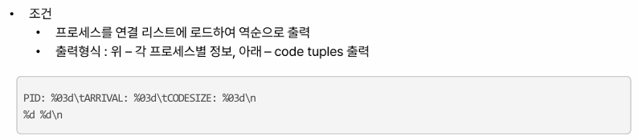
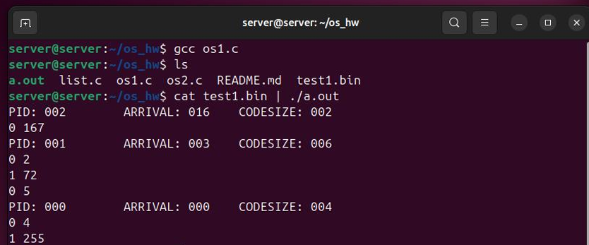
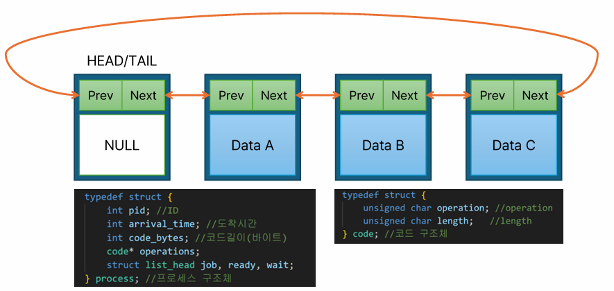
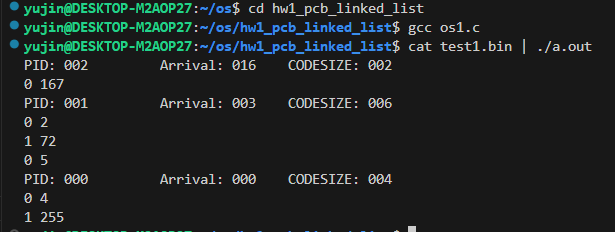

# OS hw1 Linked List Implementation Based on the Linux List Library
Linux List Library를 활용해 이중 연결 리스트 기반 queue를 구현하고,
프로세스를 선입(Enqueue)한 뒤, 마지막에 삽입된 프로세스부터 역순으로 출력하는 과제입니다.
<br><br>

## 과제 #1
#### [문제]

- Stdin으로부터 Binary 형태의 프로세스 정보와 코드를 읽어들여, 역순으로 프로세스 출력



#### [예상 결과]


<br><br>

## 프로세스 구조 

### Process 구조체

- **process**
  - `int pid` : 프로세스 ID
  
  - `int arrival_time` : 프로세스 도착 시각
  
  - `int code_bytes` : code 영역의 총 길이 (bytes 단위)
  
  - `code *operations` : 프로세스가 수행할 작업(operation) 배열
  
  - `struct list_head job, ready, wait` : 프로세스가 삽입될 리스트 노드

### Code 구조체

- **code**
  - `unsigned char operation` : 작업 종류 (0 = CPU 작업, 1 = IO 작업)
  
  - `unsigned char length` : 작업 수행 시간 (clocks 단위)
  <br><br>

  <br><br>

## 프로그램 기본 구조

#### [주요 리스트]

- **Job queue** : 이진파일로부터 로드된 프로세스들을 저장하는 리스트
<br>

#### [동작 흐름]

1. Stdin으로부터 process + code를 Binary 형태로 읽어들임

2. 읽은 프로세스들을 **job queue**에 삽입
   (→ 리스트의 tail에 추가, FIFO 방식)

3. 모든 프로세스 로드가 완료되면, **job queue를 역순으로 순회**하여  
   
   가장 마지막에 삽입된 프로세스부터  프로세스 정보를 출력
<br><br>

## 프로그램 동작 규칙

### 1. 프로세스 입력

- 프로세스 구조체(`pid`, `arrival_time`, `code_bytes`)를 먼저 읽음

- 이어서, `code` 구조체 배열(작업(operation) 리스트)을 읽어 메모리에 저장

### 2. 리스트 삽입

- 각 프로세스를 **job queue의 tail**에 삽입
  (→ `list_add_tail()` 함수 사용)

### 3. 역순 출력

- 모든 프로세스 입력이 완료되면, `list_for_each_entry_reverse` 매크로를 사용해  
  **리스트를 역방향으로 순회하면서** 프로세스 정보를 출력

### 4. 출력 포맷

```text
PID: [PID]    Arrival: [도착 시간]    CODESIZE: [코드 크기]
[operation] [length]
[operation] [length]
```

(프로세스마다 operation 리스트도 순서대로 출력)
<br><br>


## 최종 구현 결과 

