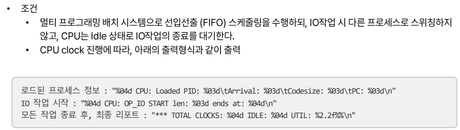
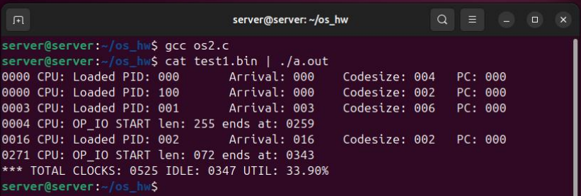
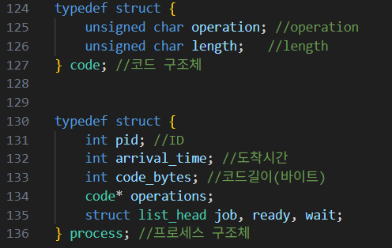
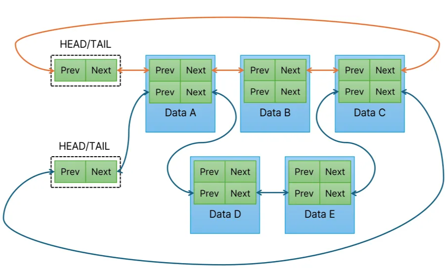
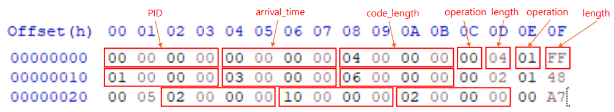
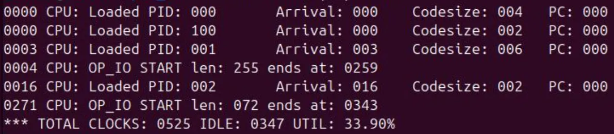
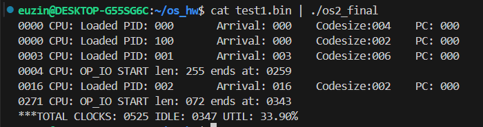

OS hw2 Multiprogramming-based Batch System Simulator
  

## 과제 #2
#### [문제]

- Stdin으로부터 Binary 형태의 프로세스 정보와 코드를 읽어와, 지정된 포맷으로 출력

#### [예상 결과]

  

## 프로세스 구조

### Process Tuple (Process + Code)

- **process**
  - `int pid` : 프로세스 ID
  
  - `int arrival_time` : 프로세스 도착 시각 (clocks 단위)
  
  - `int code_bytes` : code 영역의 총 길이 (bytes)

- **code** (여러 개 존재 가능)
  - `unsigned char operation` : 작업 종류
    
    - `00` = CPU 작업
    
    - `01` = IO 작업
   
    - `FF` = Idle 프로세스
 
  - `unsigned char length` : 작업 수행 시간 (clocks)
  

- process 하나의 구조체는  **job queue**, **ready queue**, **wait queue**에 들어갈 수 있음 -> **3개의 list_head** 포인터 가짐 

#### [프로세스 구조체의 완전한 형태]

  
  

  

## 초기 프로세스 정보

#### <총 4개의 프로세스>
| PID | Arrival Time (clocks) | Code Bytes | 작업 내용 |
|:---|:---|:---|:---|
| 0 | 0 | 4 bytes | CPU(4 clocks) → IO(255 clocks) |
| 1 | 3  | 6 bytes | CPU(2 clocks) → IO(72 clocks) → CPU(5 clocks) |
| 2 | 13 (0x10) | 2 bytes | CPU(167 clocks) |
| 100 (Idle) | 0 | 2 bytes | Idle 프로세스 (FF 00) |

- Idle 프로세스는 모든 유저 프로세스가 wait 상태일 때만 수행

  

## 시뮬레이터 기본 구조
#### [항상 존재]
- **Job queue** : 시스템에 존재하는 모든 프로세스 정보 저장 (프로그램 종료될 때까지 유지)

#### [둘 중 하나의 queue에만 속함]
- **ready queue** : CPU 작업 대기 중인 프로세스
 
- **wait queue** : IO 작업 완료 대기 중인 프로세스  
   ⇒ 각 프로세스들이 자신의 operations 모두 끝나면 job queue에만 존재  

  

## 시뮬레이터 동작 규칙
### 1. 프로세스 Load
- `clock == arrival_time`인 프로세스를 **job queue → ready queue**로 삽입

### 2. CPU 작업 수행
- ready queue에서 선입순으로 CPU 작업 수행

- 각 프로세스가 code tuple을 하나씩 순차적으로 처리

  - CPU 작업(`00`) → Clock 소모

  - IO 작업(`01`) → Idle Time 소모, wait queue로 이동

- 각 code tuple (operation) 완료 시 PC 1씩 증가

### 3. IO 작업 처리
- IO 작업 완료 후 해당 프로세스는 ready queue로 복귀.

- 주의) IO 작업 시, 다른 프로세스의 로드는 가능하나, 연산은 못하는 것으로 가정

### 4. Context Switching
- 프로세스 전환 시마다 **10 clocks** 소모 (Idle Time에 포함)

### 5. 시뮬레이터 종료
- 모든 프로세스 종료 시(ready queue에 더 이상 실행할 프로세스 없다면면) Final Report 출력

  1) 전체 수행 clocks

  2) Idle clocks

  3) CPU Utilization (%)

  

## 결과 분석

**1. 첫 번째 줄**
  - Clock = 0 : PID 000 도착 후, ready queue에 삽입

    - 참고) 조건  arrival time == clock 일 때 ready queue에 삽입됨 

  - 아직 아무 연산도 하지 않았으므로 PC = 0 

**2. 두 번째 줄**
  - Clock = 0 : 같은 시간에 PID 100 (IDLE 프로세스)도 함께 ready queue에 삽입됨

  - 이 프로세스는 항상 처음에 load 되도록 설계되어 있음 

  - 역시 초기 상태이므로 PC = 0

**3. 세 번째 줄**
  - Clock = 3 : PID 001 도착

    - 3clock > PID 1의 arrival time이 3이므로, 3 clock에 도착해서 ready queue에 로드됨
  
  - 아직 아무 연산도 하지 않았기 때문에 PC는 당연히 0

**4. 네 번째 줄**

  
  - PID 000을 보면 CPU 작업(00)은 4 clocks, IO 작업(01)은 FF clocks 만큼 진행됨

  - 그러므로 0,1,2,3 > 총 4 clocks 지난 이후, 4clock부터 IO 작업 수행 → 0번 wait queue로 이동

    - 참고 : PID 000이 0 clock에 바로 ready queue에 삽입 됐으므로, ready queue가 비어있지 않음 → context switching 없이 PID 000에 바로 CPU에 할당해서 CPU 작업을 수행해야 함

  - IO 작업 시작 004 clock > IO 작업 시간은 FF (255) clocks > 004+255 = 259에 종료

    - IO 처리 중이므로, CPU는 다른 프로세스로 switching 필요하지만,  
      IO 작업 동안 다른 프로세스 동작이 안됨으로, Idle time을 증가 시킴

**5. 다섯 번째 줄**
  - Clock = 16 : PID 002 도착

    - 이때, 16 clock 시점에 IO 작업이 수행 중이지만, 프로세스 로드는 가능함

**6. 여섯 번째 줄**
  - PID 000의 IO 작업이 끝나는 시점 = 259 clock

  - IO 작업 완료 후 새로운 프로세스의 작업을 실행하기 위해 context switching 10 clocks 발생

- 이후 PID 001 프로세스가 CPU에서 실행되는데, CPU 작업이 2 clocks 만큼 진행되므로,
  총 259 + 10 + 2 = 271 clock 시점에 PID 001의 IO 작업이 수행됨

- 271 clock > PID 001의 IO 작업 수행 > IO 작업 시간은 0x48이므로 (16*4+8 = 72 clocks) > 271 + 72 = 343에 PID 001의 IO 작업 종료

**7. 일곱 번째 줄**
  - 모든 프로세스의 작업이 종료가 되면 Final report가 출력 됨

    - Total clocks : 343 clocks + 5 clocks (PID 1 CPU 연산) + 10 clocks (PID 1 → PID 2 switching time) + 167 clocks (PID 2 CPU 연산) = 525 clocks

  - IDLE time : 255(PID 0의 IO 수행시간) + 72(PID 1의 IO 수행시간) + 20 (context switching 2번) = 347 clocks

  - UTIL (CPU 사용률) : (전체 clock - idle clock) / 전체 clock = {(525-347) / 525}*100  = 33.90%

  

## 최종 구현 결과

