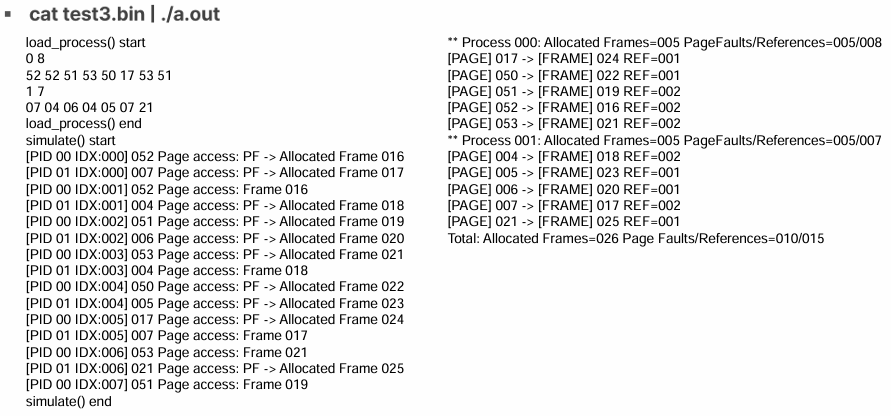

# OS hw3 Demand Paging

Demand Paging 방식으로 프로세스의 페이지 접근을 시뮬레이션하고, 메모리 할당 및 페이지 폴트를 처리하는 시스템 구현 과제입니다.
  

## 과제 #3
#### [문제]
- Stdin으로부터 Binary 형태의 프로세스 정보와 Page reference sequence를 읽어들여, 아래와 같이 출력

#### [예상 결과]

  

## Binary format

- PID (4B) : PID < 10

- page 참조 횟수 (4B) : Ref_len < 256 , Page number < 64 (0~63)

- page 참조 순서 (variable)
    
    ex. 0 번 프로세스 : PID = 0, Ref_len = 8  (0번 프로세스가 페이지 참조 8번) ⇒ 0 8 52 52 51 53 50 17 53 51   :  참조하는 페이지들
    
- **Reference sequence** : 참조 순서 (프로세스가 Page에 접근하는 순서)  → Locality(지역성) 가짐
  

## System Parameters

- **Frame, Page** 1 size = 32B

- **Physical address space**  = 32B * 256 frames = 8KB (=8192B)

- **Virtual address space** = 32B * 64 pages = 2KB (=2048B)

- **Page table entry(PTE)** = 4B (frame num + valid bit + reference bit + padding)
    - 하나의 프로세스는 64개의 PTE로 구성 ( → 페이지 하나 당 하나의 PTE이므로 )

    - Page table  크기 = 64 pages * 4B = 256B

    - 하나의 프로세스에 대한 Page table 저장 시 필요한 frame 크기 
    
     = (64 pages * 4B)/32B PAGESIZE = 8개의 frame
  

## Physical Memory Management

- Page table은 물리 메모리에 프레임 할당하여 저장, 관리 > frame 0-7 : PTE0-63

- page table이 이용하는 frame 이외에 다른 frame에는 각각의 page에 할당해줘야 함

    - 0부터 증가하며, 필요한 frame 만큼 free frame 할당

- Demand paging이므로 reference squence에 따라 page 할당 (한번에 모든 page 할당 x)

- page replacement 안 함. Frame 부족하면, Out of memory (OOM) 출력 후 종료
  

## Page Fault

- Page table 접근 시,

    1. **해당 페이지에 이미 물리 프레임 할당 O (vaild)**

        -  해당 프레임 번호로 접근 → 해당 PTE에 reference count 증가 (’참조했다’ 의미)

    2. **해당 페이지에 물리 프레임 할당 x (invaild)**

        1. Page fault 처리

        2. 새로운 물리 프레임 하나 할당받고, 

        3. Page table entry의 frame number, valid bit 업데이트

        4. 해당 프레임 번호로 접근 → 해당 PTE에 reference count 증가
  

## 출력 함수

- **load_process()** : 이진 파일에 있는 프로세스 정보 (PID, PEF_LEN),  page reference sequence (REF n)

- **simulate()** : 각 프로세스가 PID 순서대로 돌아가며 메모리 접근 → 프레임 할당하는 과정
    - 프레임 존재 : Frame %03d

    - Page Fault : PF → Allocated Frame %03d

    - 메모리 부족 : Out of memory

- **print_page_tables()** : 종료 시, 각 프로세스 별 페이지 테이블 상태
    - Allocated frames, Page faults/Regerences count
    
    - Page table : Page number, allocated frame number, reference count (Valid PTE에 대해서만)

    - 전체 Allocated frames, Page faults/Reference count 개수 출력
  

## Test3.bin 수행 결과 그림 

  

## 최종 구현 결과

