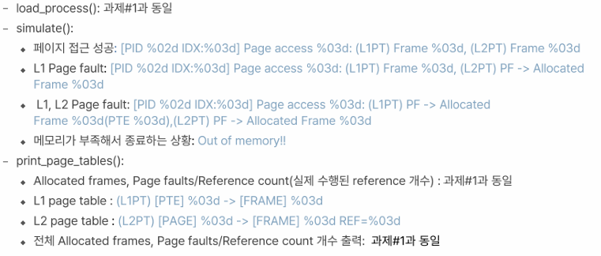
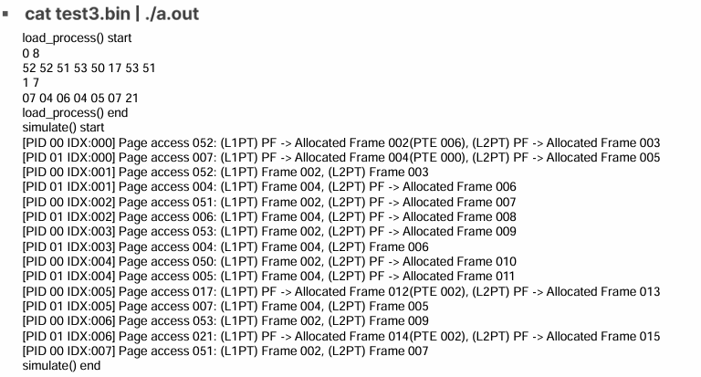
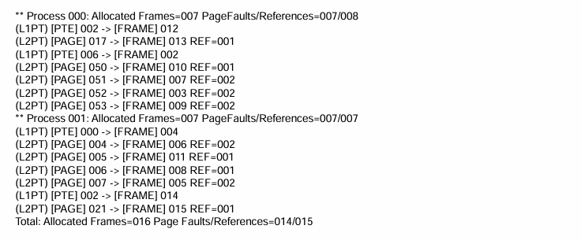
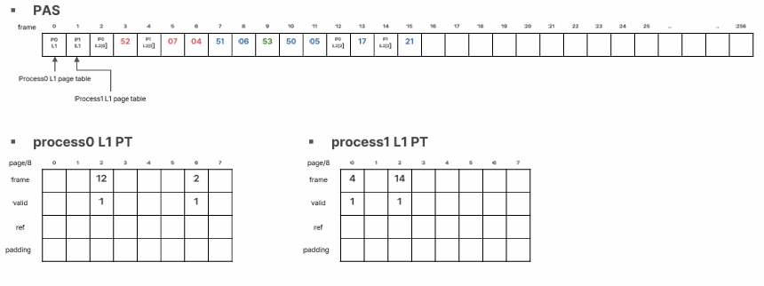
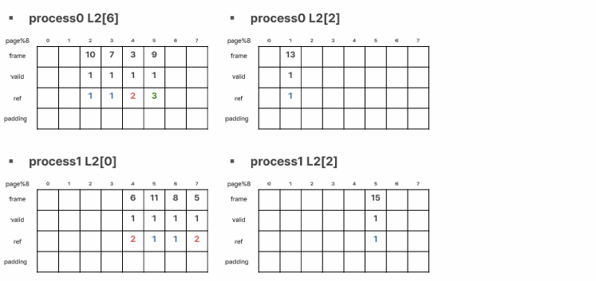
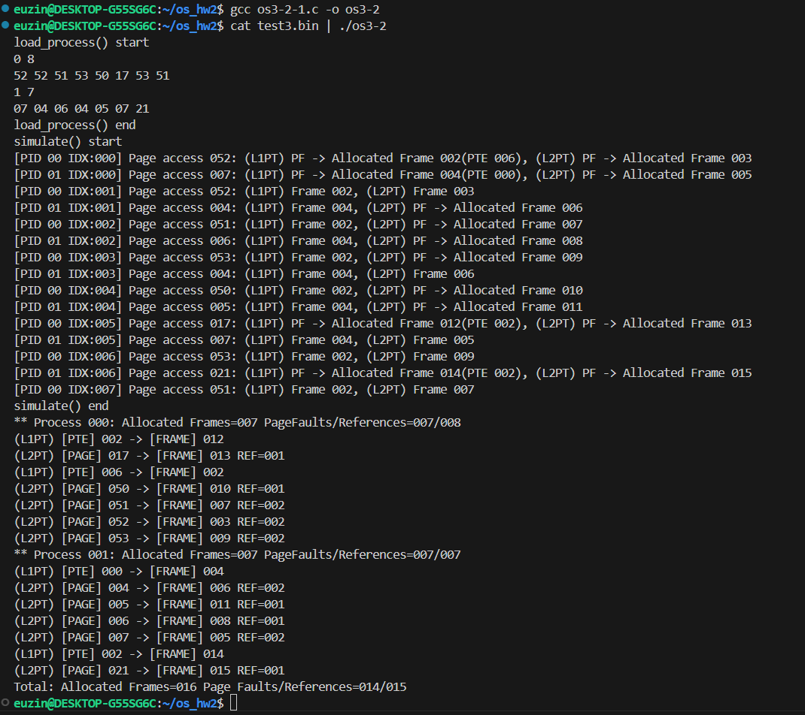

# OS hw4 Hierarchical Page Table (2-Level Demand Paging)

2-Level Hierarchical Page Table을 사용한 Demand Paging 방식으로, 프로세스의 페이지 접근을 시뮬레이션하고, 메모리 할당 및 페이지 폴트를 처리하는 시스템 구현 과제입니다.
  

## 과제 #4
#### [문제]
- 1단계 페이지 테이블의 비효율을 개선하기 위해, 2-Level Page Table 구조를 설계

- L1 Page Table → L2 Page Table → 실제 Page 접근 구조로 구현

- 각 페이지 접근에 대해 프레임 할당 여부 확인 및 Page Fault 처리 수행

#### [예상 결과]

  

## Binary Format

- PID (4B) : PID < 10

- Page 참조 횟수 (4B) : Ref_len < 256, Page number < 64 (0~63)

- Page 참조 순서 (variable)

    ex. PID = 0, Ref_len = 8  
    0 8  
    52 52 51 53 50 17 53 51

- **Reference sequence**: 페이지 접근 순서 → Locality(지역성) 보장
  

## System Parameters

- **Frame/Page Size**: 32B

- **Physical Address Space** = 32B * 256 frames = 8KB

- **Virtual Address Space** = 32B * 64 pages = 2KB

- **Page Table Entry (PTE)** = 4B (frame number + valid bit + reference count 등)

- 2단계 페이지 테이블 구성
    - L1 Page Table: 상위 8개의 엔트리 (8 * 4B = 32B) → 1 frame

    - 각 L1 entry는 하위 L2 Page Table을 가리킴

    - L2 Page Table: 하위 8개의 엔트리 (8 * 4B = 32B) → 1 frame

    - 총 페이지 수: 8(L1) * 8(L2) = 64 pages 커버 가능
  

## Page Table Management

- 각 프로세스는 L1 페이지 테이블 1개와 필요한 수의 L2 페이지 테이블을 가짐

- 물리 메모리에서 L1/L2 Page Table에 프레임 할당

- 접근 시
    - L1 PT 존재하지 않으면 Page Fault → 프레임 할당

    - 해당 L2 PT도 없으면 Page Fault → 프레임 할당

    - L2 PT를 통해 실제 Page 접근 및 Reference Count 증가
  

## Page Fault 처리

1. **L1 PT 존재 여부 확인**
    - 없으면 프레임 할당 후 valid 설정

2. **L2 PT 존재 여부 확인**
    - 없으면 프레임 할당 후 valid 설정

3. **Page 미할당 시**
    - Page Frame 할당
    
    - Reference Count 증가

4. 프레임 부족 시 Out of memory 출력 후 종료
  

## 출력 함수

- **load_process()**  

  - 이진 파일에서 프로세스 정보 및 page reference sequence 로딩

- **simulate()**  

  - L1 → L2 → Page 순으로 접근하며, 프레임 유무 확인 및 할당/접근 출력  
  - 출력 예시

    - `Page access 052: (L1PT) PF -> Allocated Frame 002(PTE 006), (L2PT) PF -> Allocated Frame 003`

    - `Page access 004: (L1PT) Frame 004, (L2PT) Frame 006`

- **print_page_tables()**  
  - 프로세스 종료 후 각 프로세스의 Page Table 상태 출력  

    - L1 PTE: 어떤 인덱스가 L2 PT를 가리키는지

    - L2 PTE: 각 Page가 할당된 Frame과 Reference Count

    - 총 Page Fault 수, Reference 수, 사용된 Frame 수 출력
  

## Test3.bin 수행 결과

  

## 최종 구현 결과

